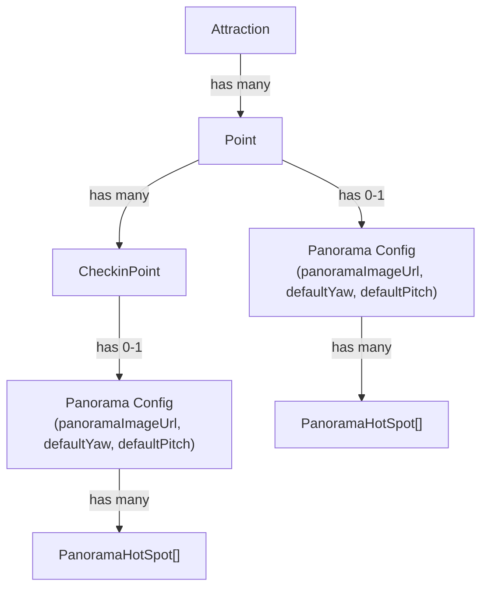

# Panorama Feature — Frontend Implementation Guide

> **Date:** 2026-02-28  
> **Backend Status:** ✅ Deployed & ready  
> **Target:** Admin panorama management + Public panorama viewer

---

## 1. Backend Overview — What Was Built

### What is the Panorama feature?

The backend now supports **360° panorama views** for both **Points** and **CheckinPoints**. Each panorama consists of:

- A **panorama image URL** (equirectangular 360° image)
- **Default camera angles** (`defaultYaw`, `defaultPitch`) in radians
- A list of **hot spots** — interactive markers placed on the 360° image with tooltip, title, description, and optional image

### Entity Relationships



> [!IMPORTANT]
> Both Point and CheckinPoint can **optionally** have their own panorama. The panorama fields live directly on the Point/CheckinPoint entity. Hot spots are in a separate `panorama_hot_spots` table with a nullable FK to either entity.

### What was created/modified on the backend

| Layer | Files |
|-------|-------|
| Entity | [PanoramaHotSpot.java](file:///e:/source/FinalProject/NeoNHS-BE/src/main/java/fpt/project/NeoNHS/entity/PanoramaHotSpot.java) (new), [Point.java](file:///e:/source/FinalProject/NeoNHS-BE/src/main/java/fpt/project/NeoNHS/entity/Point.java) (modified), [CheckinPoint.java](file:///e:/source/FinalProject/NeoNHS-BE/src/main/java/fpt/project/NeoNHS/entity/CheckinPoint.java) (modified) |
| DTOs | [PanoramaRequest.java](file:///e:/source/FinalProject/NeoNHS-BE/src/main/java/fpt/project/NeoNHS/dto/request/point/PanoramaRequest.java), [PanoramaHotSpotRequest.java](file:///e:/source/FinalProject/NeoNHS-BE/src/main/java/fpt/project/NeoNHS/dto/request/point/PanoramaHotSpotRequest.java), [PointPanoramaResponse.java](file:///e:/source/FinalProject/NeoNHS-BE/src/main/java/fpt/project/NeoNHS/dto/response/point/PointPanoramaResponse.java), [PanoramaHotSpotResponse.java](file:///e:/source/FinalProject/NeoNHS-BE/src/main/java/fpt/project/NeoNHS/dto/response/point/PanoramaHotSpotResponse.java) |
| Service | [PanoramaService.java](file:///e:/source/FinalProject/NeoNHS-BE/src/main/java/fpt/project/NeoNHS/service/PanoramaService.java) + [PanoramaServiceImpl.java](file:///e:/source/FinalProject/NeoNHS-BE/src/main/java/fpt/project/NeoNHS/service/impl/PanoramaServiceImpl.java) |
| Controller | [AdminPanoramaController.java](file:///e:/source/FinalProject/NeoNHS-BE/src/main/java/fpt/project/NeoNHS/controller/admin/AdminPanoramaController.java) (admin CRUD), [PointController.java](file:///e:/source/FinalProject/NeoNHS-BE/src/main/java/fpt/project/NeoNHS/controller/PointController.java) (public GET) |
| Repository | [PanoramaHotSpotRepository.java](file:///e:/source/FinalProject/NeoNHS-BE/src/main/java/fpt/project/NeoNHS/repository/PanoramaHotSpotRepository.java) |

---

## 2. API Contract

### 2.1 Public Endpoints (no auth)

These are for the **visitor-facing panorama viewer page**.

#### `GET /api/points/{pointId}/panorama`

Get panorama data for a Point.

#### `GET /api/points/checkin-points/{checkinPointId}/panorama`

Get panorama data for a CheckinPoint.

**Response** (both endpoints share the same shape):
```json
{
  "status": 200,
  "success": true,
  "message": "Panorama data retrieved successfully",
  "data": {
    "id": "uuid-string",
    "name": "Chùa Tam Thai",
    "address": "Ngũ Hành Sơn, Đà Nẵng",
    "description": "Ancient pagoda on Thủy Sơn mountain...",
    "panoramaImageUrl": "https://res.cloudinary.com/.../panorama-360.jpg",
    "thumbnailUrl": "https://res.cloudinary.com/.../thumb.jpg",
    "defaultYaw": 0.0,
    "defaultPitch": 0.0,
    "hotSpots": [
      {
        "id": "uuid-string",
        "yaw": 0.0,
        "pitch": 0.0,
        "tooltip": "Main Entrance",
        "title": "Main Entrance",
        "description": "The grand staircase leading up...",
        "imageUrl": "https://example.com/marker-image.jpg",
        "orderIndex": 0
      }
    ]
  },
  "timestamp": "2026-02-28T10:00:00"
}
```

**Error responses:**
| Scenario | HTTP | [success](file:///e:/source/FinalProject/NeoNHS-BE/src/main/java/fpt/project/NeoNHS/dto/response/ApiResponse.java#86-104) | `message` |
|----------|------|-----------|-----------|
| ID not found | `404` | `false` | `"Point not found with id: {id}"` |
| No panorama configured | `400` | `false` | `"Point does not have a panorama image configured"` |

---

### 2.2 Admin Endpoints (requires ADMIN role)

Base path: `/api/admin/panorama`

#### Point Panorama CRUD

| Method | URL | Description |
|--------|-----|-------------|
| `PUT` | `/api/admin/panorama/points/{pointId}` | Create or **fully replace** panorama + all hot spots |
| `GET` | `/api/admin/panorama/points/{pointId}` | Get panorama data |
| `DELETE` | `/api/admin/panorama/points/{pointId}` | Remove panorama entirely (image + hot spots) |

#### CheckinPoint Panorama CRUD

| Method | URL | Description |
|--------|-----|-------------|
| `PUT` | `/api/admin/panorama/checkin-points/{checkinPointId}` | Create or replace panorama |
| `GET` | `/api/admin/panorama/checkin-points/{checkinPointId}` | Get panorama data |
| `DELETE` | `/api/admin/panorama/checkin-points/{checkinPointId}` | Remove panorama entirely |

#### Individual Hot Spot CRUD

| Method | URL | Description |
|--------|-----|-------------|
| `POST` | `/api/admin/panorama/points/{pointId}/hotspots` | Add one hot spot to a Point |
| `POST` | `/api/admin/panorama/checkin-points/{checkinPointId}/hotspots` | Add one hot spot to a CheckinPoint |
| `GET` | `/api/admin/panorama/points/{pointId}/hotspots` | List all hot spots for a Point |
| `GET` | `/api/admin/panorama/checkin-points/{checkinPointId}/hotspots` | List all hot spots for a CheckinPoint |
| `PUT` | `/api/admin/panorama/hotspots/{hotSpotId}` | Update a single hot spot |
| `DELETE` | `/api/admin/panorama/hotspots/{hotSpotId}` | Delete a single hot spot |

#### `PUT` Request Body (Create/Update Panorama)

```json
{
  "panoramaImageUrl": "https://res.cloudinary.com/.../panorama.jpg",
  "defaultYaw": 0.0,
  "defaultPitch": 0.0,
  "hotSpots": [
    {
      "yaw": 0.0,
      "pitch": 0.0,
      "tooltip": "Main Entrance",
      "title": "Main Entrance",
      "description": "Detailed description...",
      "imageUrl": "https://example.com/image.jpg",
      "orderIndex": 0
    }
  ]
}
```

> [!TIP]
> The `PUT` endpoint does a **full replace** — all existing hot spots are removed and replaced with what's in the request. This is the recommended approach for a panorama editor UI that saves the entire state at once.

#### `POST` / `PUT` Hot Spot Request Body

```json
{
  "yaw": 0.5,
  "pitch": -0.2,
  "tooltip": "Short label (max 100 chars)",
  "title": "Panel heading (max 255 chars)",
  "description": "Full description text...",
  "imageUrl": "https://example.com/optional-image.jpg",
  "orderIndex": 0
}
```

#### Validation Rules

| Field | Rule |
|-------|------|
| `panoramaImageUrl` | Required, non-blank |
| `defaultYaw` | Optional (defaults to `0.0`) |
| `defaultPitch` | Optional (defaults to `0.0`) |
| `hotSpots[].yaw` | Required (Double, radians: −π to π) |
| `hotSpots[].pitch` | Required (Double, radians: −π/2 to π/2) |
| `hotSpots[].tooltip` | Required, max 100 chars |
| `hotSpots[].title` | Required, max 255 chars |
| `hotSpots[].description` | Required |
| `hotSpots[].imageUrl` | Optional |
| `hotSpots[].orderIndex` | Optional (defaults to array index) |

---

## 3. Frontend Implementation Plan

### 3.1 Types — `src/types/panorama.ts`

```typescript
// ─── Response Types (from API) ───

export interface PanoramaHotSpotResponse {
  id: string;
  yaw: number;
  pitch: number;
  tooltip: string;
  title: string;
  description: string;
  imageUrl: string | null;
  orderIndex: number;
}

export interface PointPanoramaResponse {
  id: string;
  name: string;
  address: string;
  description: string;
  panoramaImageUrl: string;
  thumbnailUrl: string | null;
  defaultYaw: number;
  defaultPitch: number;
  hotSpots: PanoramaHotSpotResponse[];
}

// ─── Request Types (to API) ───

export interface PanoramaHotSpotRequest {
  yaw: number;
  pitch: number;
  tooltip: string;
  title: string;
  description: string;
  imageUrl?: string | null;
  orderIndex?: number;
}

export interface PanoramaRequest {
  panoramaImageUrl: string;
  defaultYaw?: number;
  defaultPitch?: number;
  hotSpots?: PanoramaHotSpotRequest[];
}
```

Also add the `re-export` in `src/types/index.ts`:
```typescript
export * from "./panorama";
```

---

### 3.2 API Service — `src/services/api/panoramaService.ts`

```typescript
import { apiClient } from "./apiClient";
import type {
  ApiResponse,
  PointPanoramaResponse,
  PanoramaRequest,
  PanoramaHotSpotRequest,
  PanoramaHotSpotResponse,
} from "@/types";

// ─── Public endpoints ───

export const panoramaService = {
  /** Get panorama for a Point (public, no auth) */
  getPointPanorama: async (pointId: string): Promise<PointPanoramaResponse> => {
    const res = await apiClient.get<ApiResponse<PointPanoramaResponse>>(
      `/points/${pointId}/panorama`
    );
    return res.data;
  },

  /** Get panorama for a CheckinPoint (public, no auth) */
  getCheckinPointPanorama: async (
    checkinPointId: string
  ): Promise<PointPanoramaResponse> => {
    const res = await apiClient.get<ApiResponse<PointPanoramaResponse>>(
      `/points/checkin-points/${checkinPointId}/panorama`
    );
    return res.data;
  },
};

// ─── Admin endpoints ───

export const adminPanoramaService = {
  // --- Point panorama ---

  createOrUpdatePointPanorama: async (
    pointId: string,
    data: PanoramaRequest
  ): Promise<PointPanoramaResponse> => {
    const res = await apiClient.put<ApiResponse<PointPanoramaResponse>>(
      `/admin/panorama/points/${pointId}`,
      data
    );
    return res.data;
  },

  getPointPanorama: async (
    pointId: string
  ): Promise<PointPanoramaResponse> => {
    const res = await apiClient.get<ApiResponse<PointPanoramaResponse>>(
      `/admin/panorama/points/${pointId}`
    );
    return res.data;
  },

  deletePointPanorama: async (pointId: string): Promise<void> => {
    await apiClient.delete(`/admin/panorama/points/${pointId}`);
  },

  // --- CheckinPoint panorama ---

  createOrUpdateCheckinPointPanorama: async (
    checkinPointId: string,
    data: PanoramaRequest
  ): Promise<PointPanoramaResponse> => {
    const res = await apiClient.put<ApiResponse<PointPanoramaResponse>>(
      `/admin/panorama/checkin-points/${checkinPointId}`,
      data
    );
    return res.data;
  },

  getCheckinPointPanorama: async (
    checkinPointId: string
  ): Promise<PointPanoramaResponse> => {
    const res = await apiClient.get<ApiResponse<PointPanoramaResponse>>(
      `/admin/panorama/checkin-points/${checkinPointId}`
    );
    return res.data;
  },

  deleteCheckinPointPanorama: async (
    checkinPointId: string
  ): Promise<void> => {
    await apiClient.delete(
      `/admin/panorama/checkin-points/${checkinPointId}`
    );
  },

  // --- Individual hot spot CRUD ---

  addHotSpotToPoint: async (
    pointId: string,
    data: PanoramaHotSpotRequest
  ): Promise<PanoramaHotSpotResponse> => {
    const res = await apiClient.post<ApiResponse<PanoramaHotSpotResponse>>(
      `/admin/panorama/points/${pointId}/hotspots`,
      data
    );
    return res.data;
  },

  addHotSpotToCheckinPoint: async (
    checkinPointId: string,
    data: PanoramaHotSpotRequest
  ): Promise<PanoramaHotSpotResponse> => {
    const res = await apiClient.post<ApiResponse<PanoramaHotSpotResponse>>(
      `/admin/panorama/checkin-points/${checkinPointId}/hotspots`,
      data
    );
    return res.data;
  },

  getHotSpotsByPoint: async (
    pointId: string
  ): Promise<PanoramaHotSpotResponse[]> => {
    const res = await apiClient.get<ApiResponse<PanoramaHotSpotResponse[]>>(
      `/admin/panorama/points/${pointId}/hotspots`
    );
    return res.data;
  },

  getHotSpotsByCheckinPoint: async (
    checkinPointId: string
  ): Promise<PanoramaHotSpotResponse[]> => {
    const res = await apiClient.get<ApiResponse<PanoramaHotSpotResponse[]>>(
      `/admin/panorama/checkin-points/${checkinPointId}/hotspots`
    );
    return res.data;
  },

  updateHotSpot: async (
    hotSpotId: string,
    data: PanoramaHotSpotRequest
  ): Promise<PanoramaHotSpotResponse> => {
    const res = await apiClient.put<ApiResponse<PanoramaHotSpotResponse>>(
      `/admin/panorama/hotspots/${hotSpotId}`,
      data
    );
    return res.data;
  },

  deleteHotSpot: async (hotSpotId: string): Promise<void> => {
    await apiClient.delete(`/admin/panorama/hotspots/${hotSpotId}`);
  },
};

export default panoramaService;
```

---

### 3.3 Zod Validation Schema

```typescript
// src/pages/admin/panorama/schema.ts
import { z } from "zod";

export const hotSpotSchema = z.object({
  yaw: z.number({ required_error: "Yaw is required" }),
  pitch: z.number({ required_error: "Pitch is required" }),
  tooltip: z
    .string()
    .min(1, "Tooltip is required")
    .max(100, "Max 100 characters"),
  title: z
    .string()
    .min(1, "Title is required")
    .max(255, "Max 255 characters"),
  description: z.string().min(1, "Description is required"),
  imageUrl: z.string().url().optional().or(z.literal("")),
  orderIndex: z.number().optional(),
});

export const panoramaFormSchema = z.object({
  panoramaImageUrl: z
    .string()
    .min(1, "Panorama image URL is required")
    .url("Must be a valid URL"),
  defaultYaw: z.number().default(0),
  defaultPitch: z.number().default(0),
  hotSpots: z.array(hotSpotSchema).default([]),
});

export type PanoramaFormValues = z.infer<typeof panoramaFormSchema>;
export type HotSpotFormValues = z.infer<typeof hotSpotSchema>;
```

---

### 3.4 Routes to Add

```typescript
// In src/routes/index.tsx — add under the Admin section:

// Admin panorama management (nested in destinations or standalone)
{ path: "destinations/:pointId/panorama", element: <AdminPanoramaEditorPage /> },
{ path: "destinations/:pointId/checkin-points/:checkinPointId/panorama", element: <AdminPanoramaEditorPage /> },
```

> [!NOTE]
> The panorama editor is typically accessed from the **Destinations** page when an admin clicks "Edit Panorama" on a specific Point or CheckinPoint. You could also add it as a tab within the existing destination detail view.

---

### 3.5 Suggested Admin Page Structure

```
src/pages/admin/panorama/
├── AdminPanoramaEditorPage.tsx    // Main page
├── schema.ts                      // Zod schemas (section 3.3)
├── components/
│   ├── PanoramaImageUpload.tsx    // Image URL input + preview
│   ├── CameraDefaultsForm.tsx    // defaultYaw / defaultPitch inputs
│   ├── HotSpotList.tsx           // List of hot spots with edit/delete
│   ├── HotSpotFormModal.tsx      // Add/edit hot spot modal with form
│   └── PanoramaPreview.tsx       // Optional: 360° preview with Photo Sphere Viewer
└── hooks/
    └── usePanoramaEditor.ts      // Data fetching + save logic
```

---

### 3.6 Admin Hook — `usePanoramaEditor.ts`

```typescript
// src/pages/admin/panorama/hooks/usePanoramaEditor.ts
import { useState, useEffect, useCallback } from "react";
import { useParams } from "react-router-dom";
import { adminPanoramaService } from "@/services/api/panoramaService";
import type { PointPanoramaResponse, PanoramaRequest } from "@/types";
import { message } from "antd";

export function usePanoramaEditor() {
  const { pointId, checkinPointId } = useParams<{
    pointId: string;
    checkinPointId?: string;
  }>();

  const isCheckinPoint = !!checkinPointId;
  const targetId = isCheckinPoint ? checkinPointId! : pointId!;

  const [panorama, setPanorama] = useState<PointPanoramaResponse | null>(null);
  const [loading, setLoading] = useState(true);
  const [saving, setSaving] = useState(false);

  const fetchPanorama = useCallback(async () => {
    setLoading(true);
    try {
      const data = isCheckinPoint
        ? await adminPanoramaService.getCheckinPointPanorama(targetId)
        : await adminPanoramaService.getPointPanorama(targetId);
      setPanorama(data);
    } catch {
      // 400 = no panorama configured yet — that's OK for creation
      setPanorama(null);
    } finally {
      setLoading(false);
    }
  }, [targetId, isCheckinPoint]);

  useEffect(() => {
    fetchPanorama();
  }, [fetchPanorama]);

  const savePanorama = async (data: PanoramaRequest) => {
    setSaving(true);
    try {
      const saved = isCheckinPoint
        ? await adminPanoramaService.createOrUpdateCheckinPointPanorama(
            targetId,
            data
          )
        : await adminPanoramaService.createOrUpdatePointPanorama(
            targetId,
            data
          );
      setPanorama(saved);
      message.success("Panorama saved successfully");
    } catch (error) {
      message.error("Failed to save panorama");
      throw error;
    } finally {
      setSaving(false);
    }
  };

  const deletePanorama = async () => {
    try {
      isCheckinPoint
        ? await adminPanoramaService.deleteCheckinPointPanorama(targetId)
        : await adminPanoramaService.deletePointPanorama(targetId);
      setPanorama(null);
      message.success("Panorama deleted successfully");
    } catch {
      message.error("Failed to delete panorama");
    }
  };

  return {
    panorama,
    loading,
    saving,
    isCheckinPoint,
    targetId,
    savePanorama,
    deletePanorama,
    refetch: fetchPanorama,
  };
}
```

---

### 3.7 Integration with Destinations Page

The most natural place to trigger the panorama editor is from the **Admin Destinations** page, which already manages Points and CheckinPoints.

**Option A — Button on Point row:**
Add a "🔭 Panorama" button/icon to each Point and CheckinPoint row in the destinations table. When clicked, navigate to:
```
/admin/destinations/{pointId}/panorama
/admin/destinations/{pointId}/checkin-points/{checkinPointId}/panorama
```

**Option B — Tab in Point detail:**
If you have a Point detail view, add a "Panorama" tab that loads the panorama editor inline.

---

### 3.8 Sidebar Navigation (Optional)

If you want a dedicated panorama management page visible in the admin sidebar, add it under "Destinations":

```typescript
// In AdminLayout sidebar config
{
  label: "Destinations",
  icon: MapPin,
  children: [
    { label: "All Destinations", path: "/admin/destinations" },
    // No separate panorama link needed — accessed from destination detail
  ],
}
```

---

## 4. Implementation Checklist

| # | Task | Files |
|---|------|-------|
| 1 | Create panorama types | `src/types/panorama.ts`, update `src/types/index.ts` |
| 2 | Create panorama API service | `src/services/api/panoramaService.ts` |
| 3 | Create Zod validation schema | `src/pages/admin/panorama/schema.ts` |
| 4 | Create `usePanoramaEditor` hook | `src/pages/admin/panorama/hooks/usePanoramaEditor.ts` |
| 5 | Create `AdminPanoramaEditorPage` | `src/pages/admin/panorama/AdminPanoramaEditorPage.tsx` |
| 6 | Create sub-components | `src/pages/admin/panorama/components/*` |
| 7 | Add routes | `src/routes/index.tsx` |
| 8 | Add "Panorama" action to Destinations table | `src/pages/admin/destinations/components/*` |
| 9 | *(Optional)* Update public panorama viewer to call real API | `src/pages/Panorama/*` (replace mock data) |

---

## 5. Quick Reference — API Cheat Sheet

```
# ─── PUBLIC (no auth) ───
GET  /api/points/{pointId}/panorama
GET  /api/points/checkin-points/{checkinPointId}/panorama

# ─── ADMIN (/api/admin/panorama) ───

# Panorama CRUD (bulk save)
PUT    /admin/panorama/points/{pointId}                      → PanoramaRequest body
GET    /admin/panorama/points/{pointId}
DELETE /admin/panorama/points/{pointId}

PUT    /admin/panorama/checkin-points/{checkinPointId}        → PanoramaRequest body
GET    /admin/panorama/checkin-points/{checkinPointId}
DELETE /admin/panorama/checkin-points/{checkinPointId}

# Individual hot spots
POST   /admin/panorama/points/{pointId}/hotspots             → HotSpotRequest body
POST   /admin/panorama/checkin-points/{checkinPointId}/hotspots
GET    /admin/panorama/points/{pointId}/hotspots
GET    /admin/panorama/checkin-points/{checkinPointId}/hotspots
PUT    /admin/panorama/hotspots/{hotSpotId}                   → HotSpotRequest body
DELETE /admin/panorama/hotspots/{hotSpotId}
```

> [!TIP]
> For the admin editor, use the **bulk `PUT`** endpoint most of the time — it lets you save the entire panorama state (image + all hot spots) in a single request. The individual hot spot endpoints (`POST`/`PUT`/`DELETE`) are useful for **incremental edits** if you build a more interactive editor where users add/remove hot spots one at a time.
