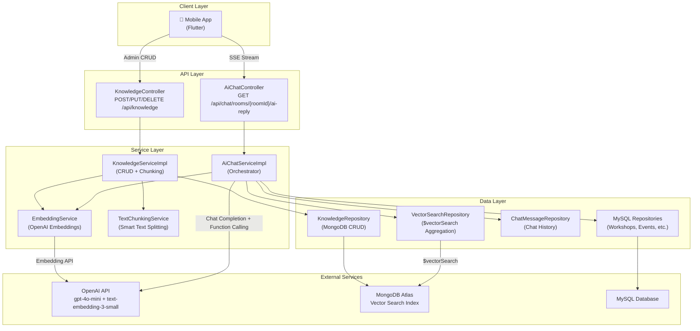
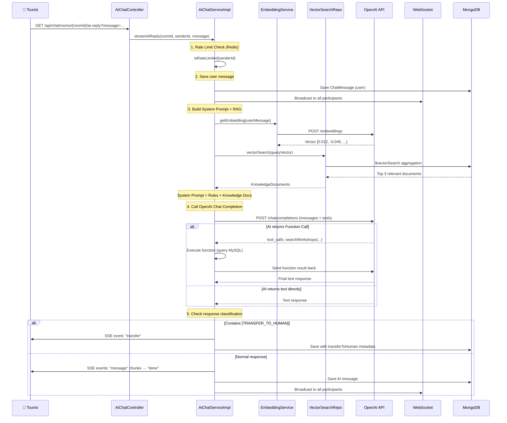
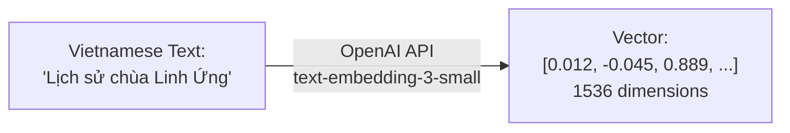
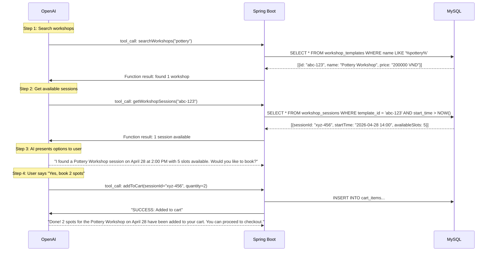
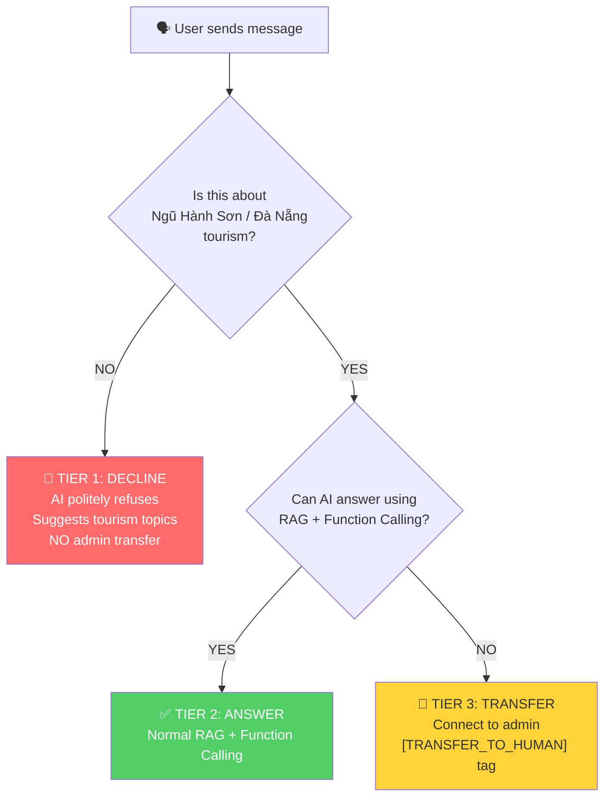
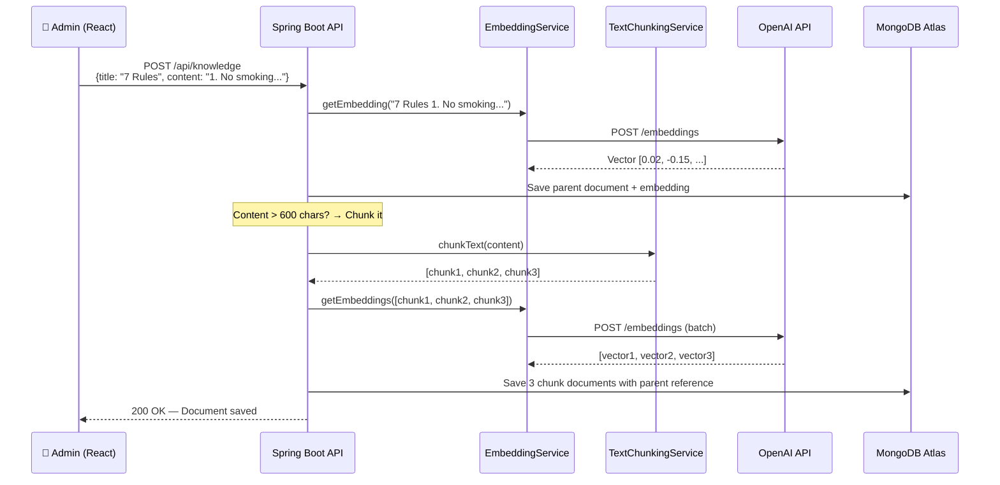

# AI Chatbot Feature — Architecture & Processing Flow

## Table of Contents
- [Overview](#overview)
- [Technology Stack](#technology-stack)
- [System Architecture](#system-architecture)
- [Data Classification Strategy](#data-classification-strategy)
- [Processing Flow: User Asks a Question](#processing-flow-user-asks-a-question)
- [RAG Pipeline (Retrieval-Augmented Generation)](#rag-pipeline-retrieval-augmented-generation)
- [Function Calling (Real-time Data)](#function-calling-real-time-data)
- [Three-Tier Response Classification](#three-tier-response-classification)
- [Knowledge Management (Admin)](#knowledge-management-admin)
- [Vector Search — How It Works](#vector-search--how-it-works)
- [API Reference](#api-reference)
- [Configuration Reference](#configuration-reference)
- [MongoDB Atlas Setup](#mongodb-atlas-setup)

---

## Overview

The NeoNHS AI Chatbot is a virtual tourism assistant for the **Ngũ Hành Sơn (Marble Mountains)** heritage site in Đà Nẵng, Vietnam. It answers tourist questions about the site's history, caves, pagodas, workshops, events, ticket prices, and regulations.

The chatbot uses two complementary AI techniques:

| Technique | Purpose | Data Source |
|-----------|---------|-------------|
| **RAG** (Retrieval-Augmented Generation) | Answer knowledge-based questions (history, regulations, guides) | MongoDB Atlas Vector Store |
| **Function Calling** | Query real-time dynamic data (ticket prices, workshop schedules, events) | MySQL Database |

This hybrid approach ensures the AI never hallucinates about dynamic data (prices, schedules) while being knowledgeable about static/semi-static content (history, regulations).

---

## Technology Stack

```
┌──────────────────────────────────────────────────────────┐
│                    Mobile App (React Native)             │
│                  SSE Stream + WebSocket                  │
└──────────────────────┬───────────────────────────────────┘
                       │
┌──────────────────────▼───────────────────────────────────┐
│                Spring Boot Backend (Java 21)             │
│                                                          │
│  ┌─────────────────┐  ┌──────────────────┐               │
│  │ AiChatController│  │KnowledgeController│              │
│  └────────┬────────┘  └────────┬─────────┘               │
│           │                    │                         │
│  ┌────────▼────────┐  ┌───────▼──────────┐               │
│  │AiChatServiceImpl│  │KnowledgeService  │               │
│  └────────┬────────┘  │     Impl         │               │
│           │           └───────┬──────────┘               │
│  ┌────────▼──────────────────▼───────────┐               │
│  │         Shared Services               │               │
│  │  ┌─────────────────┐ ┌─────────────┐  │               │
│  │  │EmbeddingService │ │TextChunking │  │               │
│  │  │     Impl        │ │  Service    │  │               │
│  │  └─────────────────┘ └─────────────┘  │               │
│  └───────────────────────────────────────┘               │
│                                                          │
│  ┌──────────────────────────────────────┐                │
│  │         Data Layer                    │               │
│  │  ┌──────────────┐ ┌───────────────┐   │               │
│  │  │VectorSearch  │ │Knowledge      │   │               │
│  │  │  Repository  │ │  Repository   │   │               │
│  │  └──────────────┘ └───────────────┘   │               │
│  └──────────────────────────────────────┘                │
└──────────────────────────────────────────────────────────┘
         │                    │                    │
┌────────▼────────┐  ┌───────▼────────┐  ┌────────▼───────┐
│   OpenAI API    │  │ MongoDB Atlas  │  │     MySQL      │
│                 │  │                │  │                │
│ • gpt-4o-mini   │  │ • knowledge_   │  │ • workshops    │
│   (Chat)        │  │   base (Vector)│  │ • events       │
│ • text-embed-   │  │ • chat_history │  │ • tickets      │
│   ding-3-small  │  │ • chat_rooms   │  │ • blogs        │
│   (Embedding)   │  │                │  │ • users        │
└─────────────────┘  └────────────────┘  └────────────────┘
```

---

## System Architecture



---

## Data Classification Strategy

Not all data should be stored as vectors. We classify data into two categories based on how frequently it changes:

### Vector Data (RAG) — Static/Semi-Static Knowledge

| Data Type | Example | Why Vector? |
|-----------|---------|-------------|
| Site History | "The Marble Mountains were formed..." | Rarely changes, requires semantic search |
| Regulations | "7 rules for visiting: No smoking..." | Changes infrequently (months/years) |
| Visitor Guides | "Best routes for 2-hour visit" | Stable content |
| Blog Content | Cultural articles, news synced by admin | Synced manually by admin decision |
| FAQ | Common tourist questions | Semi-static |

**Stored in**: MongoDB `knowledge_base` collection with vector embeddings.
**AI access**: Vector Search → injected into system prompt (RAG).

### Structured Data (Function Calling) — Dynamic/Frequently Changing

| Data Type | Example | Why NOT Vector? |
|-----------|---------|-----------------|
| Event schedules | "Festival starts June 15, 2026 at 9:00 AM" | Can change last-minute |
| Ticket prices | "Adult ticket: 40,000 VND" | Updates with promotions |
| Workshop sessions | "Pottery class at 2:00 PM, 5 slots left" | Real-time availability |
| Cart operations | "Add 2 tickets to cart" | Transactional action |

**Stored in**: MySQL database.
**AI access**: Function Calling → real-time queries on every request.

> **Why this matters**: If an event is cancelled at the last minute, the AI reading an old vector embedding might still tell guests the event is happening. Function Calling guarantees real-time accuracy for dynamic data.

---

## Processing Flow: User Asks a Question

This is the complete end-to-end flow when a tourist sends a message to the chatbot.



### Step-by-Step Breakdown

#### Step 1: Rate Limiting
- Uses Redis to track messages per user
- Limit: **10 messages per minute** per user
- Key format: `ai_rate_limit:{userId}` with 60-second TTL

#### Step 2: Save & Broadcast User Message
- Message saved to MongoDB `chat_messages` collection
- Broadcast via WebSocket to all room participants (for multi-device sync)

#### Step 3: Build System Prompt with RAG Context
This is where the RAG magic happens:

1. **Fetch system prompt** from MongoDB (admin-customizable) or use the default
2. **Embed the user's question** → call OpenAI `text-embedding-3-small` to get a 1536-dimension vector
3. **Vector search** → query MongoDB Atlas `$vectorSearch` to find the top 3 most semantically similar knowledge documents (with a minimum similarity score of 0.75)
4. **Inject knowledge** → append the found documents to the system prompt as "internal knowledge data"

The final prompt sent to OpenAI looks like:
```
[System Prompt with scope rules + transfer rules]

---
DỮ LIỆU KIẾN THỨC NỘI BỘ:
Bài viết 1: Rules for visiting Ngũ Hành Sơn
1. No smoking. 2. No breaking branches...

Bài viết 2: History of Huyền Không Cave
The cave was discovered in...

[Conversation History: last 10 messages]

[User's current message]
```

#### Step 4: OpenAI Chat Completion with Function Calling
- Sends the assembled prompt + 8 tool declarations to `gpt-4o-mini`
- If the AI decides it needs real-time data, it returns `tool_calls`
- The system executes the function (queries MySQL), returns the result, and calls OpenAI again
- This can loop up to **5 times** (for multi-step operations like: search workshop → get sessions → add to cart)

#### Step 5: Response Classification & Delivery
- Response is streamed to the client via **Server-Sent Events (SSE)** in word chunks (3 words per event, 50ms delay for natural feel)
- The `[TRANSFER_TO_HUMAN]` tag is detected for admin handover (see Three-Tier section below)
- The AI response is saved to MongoDB and broadcast via WebSocket

---

## RAG Pipeline (Retrieval-Augmented Generation)

### What is RAG?

RAG means: **Retrieve** relevant data → **Augment** the AI prompt with it → **Generate** a response.

The AI itself knows nothing about the Marble Mountains. We "teach" it by finding the most relevant knowledge articles and feeding them into the prompt before the AI generates its answer.

### The Embedding Process



**Key property**: Text with similar *meaning* produces vectors that are *close together* in mathematical space.
- "Lấy đất nặn gốm" (taking clay to mold pottery) and "Workshop làm đồ gốm" (pottery workshop) will have vectors very close to each other, even though the words are completely different.
- This is why vector search beats keyword search — it understands *semantics*, not just exact word matches.

### Vector Search vs Keyword Search

| Feature | Keyword Search (LIKE '%...%') | Vector Search |
|---------|-------------------------------|---------------|
| Query: "Where is the giant Buddha?" | ❌ Fails if DB says "Giant Buddha shrine" | ✅ Finds it — same meaning |
| Query: "Can I smoke here?" | ❌ Only finds docs containing "smoke" | ✅ Finds "No smoking" regulation |
| Speed at scale | ✅ Fast with indexes | ✅ Fast with ANN index |
| Setup complexity | Simple | Requires embedding API + vector index |

### Text Chunking

Long documents (>600 characters) are automatically split into overlapping chunks:

```
Original document (2000 chars):
┌─────────────────────────────────────────────────────────────┐
│ History of Marble Mountains. The five limestone hills...    │
│ ... during the Cham dynasty. The caves were used as...      │
│ ... Buddhist pagodas were built in the 17th century...      │
│ ... the stone carving village was established in...          │
└─────────────────────────────────────────────────────────────┘

After chunking (600 chars each, 100 char overlap):
┌───────────────────────────┐
│ Chunk 1 (0-600)           │
│ History of Marble Moun... │
│ ...the Cham dynasty. The  │◄── 100 char overlap
├───────────────────────┐   │
│ Chunk 2 (500-1100)    │   │
│ dynasty. The caves... │───┘
│ ...17th century...    │
├───────────────────┐   │
│ Chunk 3 (1000-...) │  │
│ century. The stone │──┘
│ carving village... │
└────────────────────┘
```

**Why chunk?** A single vector embedding for a 2000-character document loses specificity. A chunk about "caves" will match cave-related questions much better than a full-document embedding that also talks about pagodas and stone carving.

**Smart splitting**: Chunks are split at natural boundaries:
1. Paragraph breaks (`\n\n`) — best
2. Line breaks (`\n`)
3. Sentence boundaries (`. ` / `! ` / `? `)
4. Word boundaries (spaces)
5. Hard cut — last resort

---

## Function Calling (Real-time Data)

The AI has access to 8 functions that query live MySQL data:

| Function | Description | Data Source |
|----------|-------------|-------------|
| `searchWorkshops` | Find workshops by keyword | `workshop_templates` table |
| `getWorkshopSessions` | Get upcoming sessions for a workshop | `workshop_sessions` table |
| `searchEvents` | Find upcoming/ongoing events | `events` table |
| `getTicketPrices` | Get ticket catalog (site entry or event tickets) | `ticket_catalogs` table |
| `searchBlogs` | Find published blog articles | `blogs` table |
| `addToCart` | Add workshop/ticket to user's cart | Cart service (transactional) |
| `searchMapPoints` | Find points of interest on the map | `points` table |
| `navigateToLocation` | Trigger navigation to a map point | Returns point ID for mobile app |

### Multi-Step Function Calling Example

When a tourist says: *"I want to book a pottery workshop"*



---

## Three-Tier Response Classification

The AI follows strict rules about when to answer, decline, or transfer to a human admin.



### Tier 1: OFF-TOPIC → Decline (No Admin Transfer)

| Example Questions | AI Response |
|-------------------|-------------|
| "Translate 'hello' to Japanese" | "Xin lỗi, tôi chỉ hỗ trợ về du lịch Ngũ Hành Sơn. Bạn có muốn tìm hiểu về các hang động hoặc workshop tại đây không?" |
| "Write Python code to sort a list" | Same polite decline |
| "What's the weather in Tokyo?" | Same polite decline |

**Key rule**: The AI will **never** offer to transfer off-topic questions to an admin. This prevents admins from being flooded with irrelevant requests.

### Tier 2: ON-TOPIC → Answer

| Example Questions | AI Approach |
|-------------------|-------------|
| "Tell me about Huyền Không Cave" | RAG: finds knowledge article about the cave |
| "What workshops are available?" | Function Calling: queries MySQL for workshops |
| "Is smoking allowed?" | RAG: finds regulation document |
| "How much is a ticket?" | Function Calling: queries ticket catalog |

### Tier 3: ON-TOPIC + NEEDS HUMAN → Transfer

| Example Questions | Why Transfer? |
|-------------------|---------------|
| "I lost my wallet at Linh Ứng Pagoda" | Emergency — needs human assistance |
| "I want to book a tour for 50 people" | Custom group booking — needs staff |
| "I need a refund for my ticket" | Payment issue — needs admin |
| "I want to speak to a real person" | User explicitly requested it |
| "I have a disability and need wheelchair access" | Special accommodation needed |

**Technical implementation**: The AI appends `[TRANSFER_TO_HUMAN]` tag to its response. The Java backend detects this tag (strict match, no fuzzy detection) and triggers the admin handover flow via WebSocket.

---

## Knowledge Management (Admin)

Admins manage the AI's knowledge base through the Knowledge CRUD API. The admin experience is text-only — they never see vectors or embeddings.

### Admin Workflow: Adding Knowledge



### Admin Workflow: Updating Knowledge

When admin updates a document (e.g., from 5 rules to 7 rules):

1. Old chunks are **deleted** from MongoDB
2. Parent document text and embedding are **updated**
3. New chunks are **re-created** with new embeddings
4. Next time a tourist asks a question, the vector search finds the **updated** content

### Admin Workflow: Blog Sync

Admins manually choose which blog posts to include in the AI knowledge base:

```
POST /api/knowledge/sync-blog
{
    "blogId": "uuid-of-blog",
    "title": "History of Stone Carving in Ngũ Hành Sơn",
    "content": "The stone carving tradition dates back..."
}
```

The blog content is vectorized and chunked, becoming searchable by the AI. If the blog is updated, re-sync it. If the blog should no longer be AI knowledge, remove it:

```
DELETE /api/knowledge/sync-blog/{blogId}
```

### Knowledge Types

| Type | Description | Example |
|------|-------------|---------|
| `INFORMATION` | General knowledge (default) | Site information, FAQ |
| `SYSTEM_PROMPT` | AI behavior instructions | System prompt (1 per system) |
| `REGULATION` | Rules and regulations | "7 rules for visiting" |
| `GUIDE` | Visitor guides | "Best routes for 2-hour visit" |
| `BLOG` | Blog content (synced from MySQL) | Cultural articles |

---

## Vector Search — How It Works

### MongoDB Atlas $vectorSearch

Instead of loading all documents into Java memory and computing cosine similarity in a loop, we use MongoDB Atlas's native vector search:

```javascript
// The aggregation pipeline that runs on MongoDB Atlas
db.knowledge_base.aggregate([
  {
    $vectorSearch: {
      index: "vector_index",           // Pre-built ANN index
      path: "embedding",               // Field containing the vector
      queryVector: [0.012, -0.045, ...], // User question embedding
      numCandidates: 30,               // Search pool size
      limit: 3,                        // Return top 3
      filter: {
        isActive: true,
        knowledgeType: { $ne: "SYSTEM_PROMPT" }
      }
    }
  },
  {
    $addFields: {
      searchScore: { $meta: "vectorSearchScore" }
    }
  },
  {
    $match: {
      searchScore: { $gte: 0.75 }      // Minimum relevance threshold
    }
  }
])
```

### Performance Comparison

| Approach | 100 docs | 1,000 docs | 10,000 docs |
|----------|----------|------------|-------------|
| **Old**: Java in-memory cosine similarity | ~10ms | ~100ms | ~1000ms |
| **New**: MongoDB Atlas $vectorSearch | ~5ms | ~5ms | ~8ms |

Atlas uses an **Approximate Nearest Neighbor (ANN)** index, which is O(log n) instead of O(n).

---

## API Reference

### Chat Endpoints

| Method | Endpoint | Description |
|--------|----------|-------------|
| `GET` | `/api/chat/rooms/{roomId}/ai-reply?message=...` | Stream AI response via SSE |

**SSE Events**:
- `message` — Partial text chunk: `{"text": "Hang Huyền Không "}`
- `done` — Completion: `{"fullText": "Hang Huyền Không là..."}`
- `transfer` — Handover to admin: `{"message": "Tôi sẽ kết nối bạn..."}`
- `error` — Error: `{"error": "Rate limited"}`

### Knowledge Management Endpoints

| Method | Endpoint | Description |
|--------|----------|-------------|
| `POST` | `/api/knowledge` | Create a knowledge document |
| `PUT` | `/api/knowledge/{id}` | Update a knowledge document |
| `DELETE` | `/api/knowledge/{id}` | Delete a knowledge document + its chunks |
| `GET` | `/api/knowledge` | List knowledge documents (paginated) |
| `GET` | `/api/knowledge/{id}` | Get a single document |
| `PATCH` | `/api/knowledge/{id}/visibility` | Toggle visibility (isActive) |
| `POST` | `/api/knowledge/upload` | Upload file → extract text → vectorize |
| `POST` | `/api/knowledge/sync-blog` | Sync a blog post to AI knowledge |
| `DELETE` | `/api/knowledge/sync-blog/{blogId}` | Remove blog from AI knowledge |
| `POST` | `/api/knowledge/{id}/re-embed` | Re-generate embeddings for one document |
| `GET` | `/api/knowledge/search?query=...&limit=5` | Test vector search (admin tool) |
| `POST` | `/api/knowledge/re-embed-all` | Migration: re-embed all documents |

---

## Configuration Reference

### application.yaml

```yaml
# OpenAI Configuration
openai:
  api-key: ${OPENAI_API_KEY}         # Your OpenAI API key
  model: gpt-4o-mini                 # Chat model
  base-url: https://api.openai.com/v1
  embedding-model: text-embedding-3-small  # Embedding model (1536 dims)
  embedding-dimensions: 1536

# Vector Search Configuration
vector-search:
  chunk-size: 600          # Max characters per text chunk
  chunk-overlap: 100       # Overlapping characters between chunks
  min-similarity-score: 0.75  # Minimum relevance (0.0–1.0)
  max-results: 3           # Max documents injected into prompt
  index-name: vector_index # MongoDB Atlas Vector Search index name
```

---

## MongoDB Atlas Setup

### Step 1: Create the Vector Search Index

Go to **MongoDB Atlas → Database → Your Cluster → Atlas Search → Create Search Index** → select JSON Editor and use:

```json
{
  "name": "vector_index",
  "type": "vectorSearch",
  "definition": {
    "fields": [
      {
        "type": "vector",
        "path": "embedding",
        "numDimensions": 1536,
        "similarity": "cosine"
      },
      {
        "type": "filter",
        "path": "isActive"
      },
      {
        "type": "filter",
        "path": "knowledgeType"
      }
    ]
  }
}
```

**Target collection**: `knowledge_base`

### Step 2: Migrate Existing Data

After creating the index, call the migration endpoint to re-chunk and re-embed all existing knowledge documents:

```bash
curl -X POST http://localhost:8080/api/knowledge/re-embed-all \
  -H "Authorization: Bearer {admin-token}"
```

This will process every document: generate new embeddings, create chunks, and store them with the proper structure for vector search.

---

## Key Files Reference

| File | Role |
|------|------|
| `AiChatServiceImpl.java` | Main orchestrator — SSE streaming, prompt building, function calling loop |
| `EmbeddingServiceImpl.java` | OpenAI embedding API client (single + batch) |
| `TextChunkingServiceImpl.java` | Smart text splitting with boundary detection |
| `VectorSearchRepository.java` | MongoDB Atlas $vectorSearch aggregation |
| `KnowledgeServiceImpl.java` | Knowledge CRUD with auto-chunking and embedding |
| `KnowledgeDocument.java` | MongoDB document model for the knowledge base |
| `KnowledgeRepository.java` | MongoDB Spring Data repository |
| `OpenAiConfig.java` | OpenAI connection configuration |
| `AiChatController.java` | REST endpoint for AI chat (SSE) |
| `KnowledgeController.java` | REST endpoints for knowledge management |
